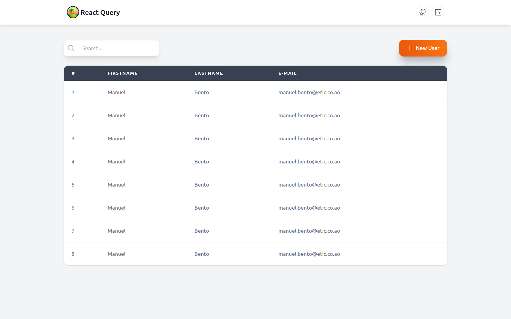

<h1 align="center">
  📸📝<br>Tanstack React Query
</h1>




Este projeto é um exemplo prático de como utilizar o Tanstack React Query para gerenciamento de dados e cache em aplicações React. O React Query facilita o gerenciamento de estados relacionados a dados assíncronos, oferecendo uma API simples para busca, cache e sincronização de dados.

## Descrição

O **TanstackQuery** é uma aplicação React que demonstra as funcionalidades e práticas recomendadas do Tanstack React Query. A aplicação inclui exemplos de:

- **Consultas (Queries):** Como buscar e cachear dados de uma API.
- **Mutations:** Como criar, atualizar e deletar dados.
- **Paginação e Infinito Scroll:** Gerenciamento de dados paginados e carregamento infinito.

## Funcionalidades

- **Busca de Dados:** Visualize dados obtidos de uma API de exemplo.
- **Manipulação de Dados:** Adicione, atualize e exclua itens usando React Query.

## Tecnologias Utilizadas

- [React](https://reactjs.org/)
- [Tanstack React Query](https://tanstack.com/query)
- [Axios](https://axios-http.com/) (requisições HTTP)
- [React Router](https://reactrouter.com/) (navegação)
- [React Hot Toast](https://react-hot-toast.com/) (Toast Notification)
- [TailwindCSS](https://tailwindcss.com/) (estilo)

## Instalação

1. Clone este repositório:
   ```bash
   git clone https://github.com/manuelbento19/tanstack-query.git
   ```

2. Navegue até o diretório do projeto:
   ```bash
   cd tanstack-query
   ```

3. Instale as dependências:
   ```bash
   npm install
   ```

4. Inicie a aplicação:
   ```bash
   npm start
   ```

5. Acesse a aplicação no seu navegador em [http://localhost:3000](http://localhost:3000).

## Uso

Explore o projeto para entender como o TanstackQuery é integrado e utilizado. As funcionalidades principais estão localizadas em componentes específicos que demonstram as práticas recomendadas para gerenciamento de dados.

## Contribuições

Se você encontrar problemas ou tiver sugestões de melhorias, sinta-se à vontade para abrir uma issue ou enviar um pull request.

## Licença

Este projeto está licenciado sob a [MIT License](LICENSE).
<h2>👨‍🚀 Autor</h2>

<table>
  <tr>
    <td>
      <a href="https://github.com/manuelbento19">
        <br>
        <sub>
          <b>Manuel Bento</b>
        </sub>
      </a>
    </td>
  </tr>
</table>